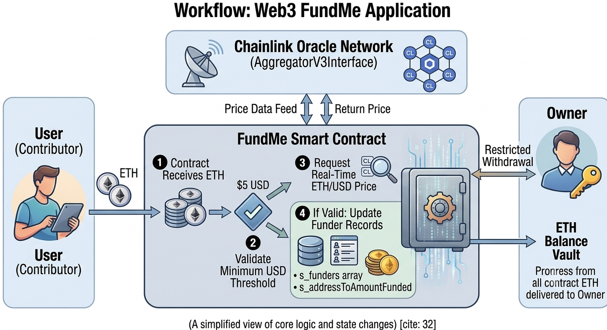

<div align="center">
  <h1>💰 Web3 FundMe Application</h1>
  <p><b>A decentralized crowdfunding layer with automated USD price bounds via Chainlink Oracles</b></p>
</div>

## 📖 About the Project

The **Web3 FundMe Application** is a production-ready Web3 Smart Contract project built with **Solidity** and rigorously tested across multiple networks using the **Foundry** framework. At its core, the project acts as a decentralized crowdfunding platform that allows users to fund a contract with native Ether (ETH), while ensuring all contributions meet a strict minimum USD threshold.

This architecture is ideal for decentralized autonomous organizations (DAOs), public goods funding, or Web3 startups executing transparent capital raises. By integrating decentralized oracle networks, it guarantees accurate, real-time value assessment regardless of market volatility.

**Key Technical Highlights:**
* **Solidity `^0.8.28`:** Leveraging modern compiler features for optimal security and gas efficiency.
* **Chainlink Oracles:** Utilizes `AggregatorV3Interface` to fetch highly secure and reliable off-chain ETH/USD price data.
* **Foundry Framework:** Complete with high-speed testing, state assertions, gas optimization tracking, and multi-chain deployment scripts (including ZkSync).
* **Gas-Optimized State Management:** Implements memory-caching strategies (`cheaperWithdraw`) to significantly reduce gas costs during state-heavy array iterations.

---

## ⚙️ How It Works

The `FundMe` contract requires users to send a minimum amount of USD (defaulted to $5) in the form of ETH. Because Ethereum does not natively understand USD value, the contract relies on a `PriceConverter` library connected to a Chainlink Price Feed. 

When a user calls the `fund()` function, the contract calculates the real-time USD equivalent of the sent ETH. If the value is sufficient, the user's address and amount are recorded in the contract's state. The contract owner holds exclusive rights to withdraw the accumulated funds, which automatically resets the funders' data structures to prepare for future funding rounds.

### Architecture Diagram



[FundMe.sol](./src/FundMe.sol) - Main Application Logic

[PriceConverter.sol](./src/PriceConverter.sol) - Oracle Price Conversion Library

[HelperConfig.s.sol](./script/HelperConfig.s.sol) - Multi-Network Deployment Configuration

---

## 💻 Technical Docs

The primary interaction points of the application handle incoming funds, price conversions, and secure withdrawals. The contract restricts critical actions using custom modifiers and custom errors (`FundMe__NotOwner()`) to save gas compared to traditional string reverts.

### fund
The entry point for users to send ETH. It utilizes the `PriceConverter` to ensure the `msg.value` meets the `MINIMUM_USD` requirement before updating the state mapping and array.

```solidity
    function fund() public payable {
        require(
            msg.value.getConversionRate(s_priceFeed) >= MINIMUM_USD,
            "You need to spend more ETH!"
        );
        s_addressToAmountFunded[msg.sender] += msg.value;
        s_funders.push(msg.sender);
    }
```

### cheaperWithdraw
A highly gas-optimized withdrawal function restricted to the contract owner. It reads the storage array into memory once, iterates over the memory array to zero out balances, and securely transfers the contract's entire ETH balance to the owner using a low-level call.

```Solidity
    function cheaperWithdraw() public onlyOwner {
        address[] memory funders = s_funders;
        
        for (uint256 funderIndex = 0; funderIndex < funders.length; funderIndex++) {
            address funder = funders[funderIndex];
            s_addressToAmountFunded[funder] = 0;
        }
        
        s_funders = new address[](0);
        
        (bool success, ) = i_owner.call{value: address(this).balance}("");
        require(success);
    }
```

### getConversionRate (PriceConverter.sol)
Calculates the actual USD value of the provided ETH amount by fetching the latest round data from the assigned Chainlink aggregator.

```Solidity
    function getConversionRate(
        uint256 ethAmount,
        AggregatorV3Interface priceFeed
    ) internal view returns (uint256) {
        uint256 ethPrice = getPrice(priceFeed);
        uint256 ethAmountInUsd = (ethPrice * ethAmount) / 1000000000000000000;
        
        return ethAmountInUsd;
    }
```

🚀 Execution Example
Here is a step-by-step example of how the application operates in a live environment:

- Step 1: Setup & Deploy: The Owner deploys the contract via DeployFundMe.s.sol. The HelperConfig automatically detects the current chain (e.g., Sepolia, ZkSync, or local Anvil) and assigns the correct Chainlink ETH/USD price feed address. On a local Anvil chain, it deploys a MockV3Aggregator to simulate real oracle data.

- Step 2: User Funding: A User decides to contribute to the project. They call the fund() function and attach 0.1 ETH as the msg.value.

- Step 3: Oracle Validation: The contract passes the 0.1 ETH value to the PriceConverter library. The library checks the Chainlink aggregator, determines the current price of ETH, and calculates the USD value. Since 0.1 ETH is vastly greater than the $5 minimum, the transaction succeeds.

- Step 4: State Update: The user's address is pushed to the s_funders array, and their total contribution is logged in the s_addressToAmountFunded mapping.

- Step 5: Owner Withdrawal: The Owner calls cheaperWithdraw(). The contract loops through the funders array in memory, resets all individual mapped balances to zero, clears the array, and uses a low-level call to transfer the accumulated ETH to the Owner's wallet securely.

⬆️ Installation
Ensure you have Foundry installed on your machine. Install the required project dependencies, including Chainlink interfaces and Forge Standard Library:

```Bash
forge install smartcontractkit/chainlink-brownie-contracts foundry-rs/forge-std
```

🧪 Testing
```Bash
forge test -vvvv
```
(To test on a specific network fork, append --fork-url <YOUR_RPC_URL> to the command)


📊 Coverage
```Bash
forge coverage
```

📜 Contract Address
(Provide deployed contract addresses here upon mainnet/testnet launch)